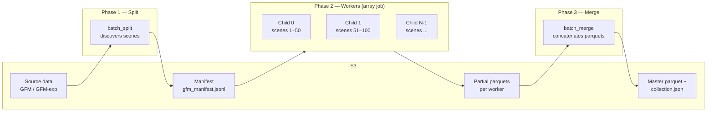

# AWS Batch Pipeline

Scale GFM and GFM Expanded ingestion to tens of thousands of scenes using a 3-phase AWS Batch pipeline. Infrastructure is managed with Terraform; the Python orchestrator handles job submission and polling.

**Key files**:

| File | Purpose |
|------|---------|
| `terraform/` | Infrastructure as code (ECR, compute env, queue, 6 job definitions) |
| `terraform/terraform.tfvars` | All configurable values — gitignored; copy from `.tfvars.example` |
| `terraform/terraform.tfvars.example` | Template with placeholder values for new setups |
| `scripts/build_and_push.sh` | Build Docker image and push to ECR |
| `scripts/submit_pipeline.py` | Python orchestrator — submits split → workers → merge with polling |
| `scripts/batch-entrypoint.sh` | Container entrypoint (injects `--job-index` for array workers) |

---

## Overview



**Split** discovers all scenes (or a filtered subset by date) and writes a manifest to S3. **Workers** run as an array job — each child reads its slice of the manifest, processes scenes in parallel, and writes a partial parquet. **Merge** concatenates all partial parquets into the master parquet and rebuilds `collection.json`.

---

## Prerequisites

- AWS account with permissions for Batch, ECR, S3, CloudWatch Logs
- [Terraform](https://developer.hashicorp.com/terraform/install)
- Docker (for building images)
- Python with `boto3` installed

---

## Quick Start

### 1. Configure

Copy the example and fill in your values (`terraform.tfvars` is gitignored):

```bash
cp terraform/terraform.tfvars.example terraform/terraform.tfvars
```

Edit `terraform/terraform.tfvars` with your AWS account, IAM roles, networking, and S3 paths.

### 2. Deploy Infrastructure

```bash
terraform init
terraform plan
terraform apply
```

This creates: ECR repository, CloudWatch log group, Batch compute environment, job queue, and 6 job definitions (split/worker/merge for GFM and GFM Expanded). S3 paths are passed as `Ref::` parameters at submit time — not baked into the image.

### 3. Build and Push Docker Image

```bash
bash scripts/build_and_push.sh
```

Only needed when code changes (`ingest/`, `Dockerfile`, `scripts/batch-entrypoint.sh`). Changing S3 paths in `terraform.tfvars` does **not** require a rebuild.

### 4. Submit the Pipeline

```bash
# GFM — full run
python scripts/submit_pipeline.py \
  --pipeline gfm \
  --profile test-se \
  --s3-profile Data

# GFM Expanded — with date filter
python scripts/submit_pipeline.py \
  --pipeline gfm_exp \
  --after-date 2024-01-01 \
  --before-date 2024-06-30 \
  --profile test-se \
  --s3-profile Data

# Dry run first (no jobs submitted)
python scripts/submit_pipeline.py --pipeline gfm --dry-run
```

The script submits Phase 1, polls until done, reads the manifest size from S3, computes the array size, submits Phase 2, polls, then submits Phase 3.

### 5. Monitor

The script prints status every `--poll-interval` seconds (default 30). For array jobs it shows per-status counts (`RUNNING=12 SUCCEEDED=38 FAILED=0`). The script URL-prints the AWS Batch console link on completion.

CloudWatch logs:

```bash
# Stream all benchmarkcat logs
aws logs tail /aws/batch/benchmarkcat --follow --profile test-se

# Filter to a specific phase
aws logs tail /aws/batch/benchmarkcat --follow --profile test-se --filter-pattern "gfm-worker"
```

### 6. Cleanup

```bash
terraform destroy
```

Removes ECR repository, log group, compute environment, job queue, and all job definitions. Does **not** delete S3 data or IAM roles.

---

## Production Runs

Phase 2 can run for hours. For production, run the orchestrator under `tmux` on your EC2 workspace so it survives SSH disconnects:

```bash
tmux new -s benchmarkcat

python scripts/submit_pipeline.py \
  --pipeline gfm \
  --scenes-per-job 50 \
  --profile test-se \
  --s3-profile Data \
  --poll-interval 60
```

---

## `submit_pipeline.py` Reference

```
python scripts/submit_pipeline.py [options]
```

| Flag | Default | Description |
|------|---------|-------------|
| `--pipeline` | *(required)* | `gfm` or `gfm_exp` |
| `--bucket-name` | from terraform | Override S3 bucket |
| `--scenes-per-job` | from terraform | Scenes per array child (controls array size) |
| `--after-date` | — | Only include scenes ≥ YYYY-MM-DD (split phase only) |
| `--before-date` | — | Only include scenes ≤ YYYY-MM-DD (split phase only) |
| `--dates` | — | Comma-separated specific dates (split phase only) |
| `--profile` | `test-se` | AWS profile for Batch API calls |
| `--s3-profile` | same as `--profile` | AWS profile for S3 access (if different from Batch) |
| `--region` | `us-east-1` | AWS region |
| `--poll-interval` | `30` | Seconds between status polls |
| `--dry-run` | false | Print what would be submitted without submitting |

Date filters apply **only to Phase 1 (split)**. Workers process their manifest slice as-is; they do not re-apply date filters. A sidecar `<manifest>.meta.json` is written with `total_scenes` and any active filters for auditing.

---

## Configuration Reference

All variables are declared in `terraform/variables.tf` with defaults. Override in `terraform/terraform.tfvars`.

### Compute

| Variable | Default | Description |
|----------|---------|-------------|
| `instance_types` | `["m5.xlarge", "m5.2xlarge", "r5.xlarge", "r5.2xlarge"]` | CPU instance type(s); Batch picks the best available |
| `max_vcpus` | `256` | Max vCPUs across all running instances |
| `use_spot` | `false` | Use Spot instances (~60–70% cheaper; risk of interruption) |

### S3 / Pipeline Paths

| Variable | Default | Description |
|----------|---------|-------------|
| `s3_bucket` | `fimc-data` | S3 bucket for all I/O |
| `scenes_per_job` | `50` | Default scenes per worker; controls array size |
| `catalog_path` | `benchmark/stac-bench-cat/` | Root catalog prefix |
| `hucs_object_key` | `benchmark/.../WBDHU8_webproj.gpkg` | HUC8 boundaries (shared) |
| `boundaries_object_key` | `benchmark/.../Mexico_Canada_boundaries.gpkg` | Country boundaries (shared) |
| `gfm_asset_object_key` | `benchmark/rs/gfm/` | GFM source data prefix |
| `gfm_manifest_s3_key` | `benchmark/.../batch/gfm_manifest.jsonl` | GFM manifest |
| `gfm_partial_parquet_prefix` | `benchmark/.../batch/gfm_partials` | GFM partial parquets |
| `gfm_derived_metadata_path` | `benchmark/.../gfm_collection.parquet` | GFM master parquet |
| `gfm_exp_*` | *(same pattern, PI4 paths)* | GFM Expanded equivalents |

---

## Troubleshooting

**AccessDenied on S3 (orchestrator)**: The orchestrator reads the manifest metadata from S3 locally to compute array size. Use `--s3-profile Data` if your Batch profile (`test-se`) lacks S3 permissions.

**Worker OOM (exit code 137)**: Increase `worker_memory` in `terraform.tfvars` and run `terraform apply`. Default is 16 GB; try 32768 for very large scenes.
