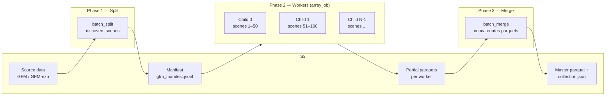

# AWS Batch Pipeline

Scale GFM and GFM Expanded ingestion to tens of thousands of scenes using a 3-phase AWS Batch pipeline. Infrastructure is managed with Terraform; the Python orchestrator handles job submission and polling.

**Key files**:


| File                                 | Purpose                                                                                                                                                                                                                                                                  |
| ------------------------------------ | ------------------------------------------------------------------------------------------------------------------------------------------------------------------------------------------------------------------------------------------------------------------------ |
| `terraform/`                         | Infrastructure as code (ECR, compute env, queue, 6 job definitions)                                                                                                                                                                                                      |
| `terraform/terraform.tfvars`         | All configurable values — gitignored; copy from `.tfvars.example`                                                                                                                                                                                                        |
| `terraform/terraform.tfvars.example` | Template with placeholder values for new setups                                                                                                                                                                                                                          |
| `scripts/build_and_push.sh`          | Build Docker image and push to ECR; reads `aws_account_id`, `aws_region`, `aws_profile` from terraform outputs (falls back to env vars)                                                                                                                                  |
| `scripts/run_pipeline_prefect.py`    | Prefect orchestrator — submits split → workers → merge with async polling, retries, and UI observability                                                                                                                                                                 |
| `scripts/batch-entrypoint.sh`        | Cloud-agnostic entrypoint; injects `--job-index` from `AWS_BATCH_JOB_ARRAY_INDEX`, `AZ_BATCH_TASK_ID`, or `BATCH_TASK_INDEX`; converts optional env vars `AFTER_DATE`, `BEFORE_DATE`, `DATES` into `--after-date`, `--before-date`, `--dates` for the split job when set |


---

## Overview



**Split** discovers all scenes (or a filtered subset by date) and writes a manifest to S3. **Workers** run as an array job — each child reads its slice of the manifest, processes scenes in parallel, and writes a partial parquet. **Merge** concatenates all partial parquets into the master parquet and rebuilds `collection.json`.

---

## Prerequisites

- AWS account with permissions for Batch, ECR, S3, CloudWatch Logs
- [Terraform](https://developer.hashicorp.com/terraform/install)
- Docker (for building images)
- Python with `boto3` and `prefect` installed (`pip install boto3 prefect`)

**Note:** `run_pipeline_prefect.py` requires Terraform outputs. Run `terraform init` and `terraform apply` before submitting; otherwise the flow exits with an error.

---

## Quick Start

### 1. Configure

Copy the example and fill in your values (`terraform.tfvars` is gitignored):

```bash
cp terraform/terraform.tfvars.example terraform/terraform.tfvars
```

Edit `terraform/terraform.tfvars` with your AWS account, IAM roles, networking, and S3 paths.

### 2. Deploy Infrastructure

```bash
terraform init
terraform plan
terraform apply
```

This creates: ECR repository, CloudWatch log group, Batch compute environment, job queue, and 6 job definitions (split/worker/merge for GFM and GFM Expanded). S3 paths are passed as `Ref::` parameters at submit time — not baked into the image.

### 3. Build and Push Docker Image

```bash
cd ..
chmod +x ./scripts/build_and_push.sh
./scripts/build_and_push.sh
```

The script reads `aws_account_id`, `aws_region`, and `aws_profile` from terraform outputs first, then falls back to env vars (`AWS_ACCOUNT_ID`, `AWS_REGION`, `AWS_PROFILE`). If neither terraform nor env vars are set, it fails with a clear error.

Only needed when code changes (`ingest/`, `Dockerfile`, `scripts/batch-entrypoint.sh`). Changing S3 paths in `terraform.tfvars` does **not** require a rebuild.

### 4. Submit the Pipeline

**Optional:** start the Prefect UI first (in a separate terminal) to get live task-level observability:

```bash
prefect server start
# UI available at http://127.0.0.1:4200
```

The flow runs fine without a server — Prefect just won't record state remotely.

```bash
# GFM — full run
python scripts/run_pipeline_prefect.py \
  --pipeline gfm \
  --profile <your-aws-profile> \
  --s3-profile <your-s3-profile> \
  --scenes-per-job 10 \
  --poll-interval 45

# GFM Expanded — with date filter
python scripts/run_pipeline_prefect.py \
  --pipeline gfm_exp \
  --after-date 2024-01-01 \
  --before-date 2024-06-30 \
  --profile <your-aws-profile> \
  --s3-profile <your-s3-profile>

# Dry run first (no jobs submitted)
python scripts/run_pipeline_prefect.py --pipeline gfm --dry-run
```

The orchestrator runs a Prefect flow with an explicit Split → Workers → Merge task DAG. Each phase submits a Batch job, polls asynchronously until complete, and creates a Prefect artifact with job details. If a task fails, Prefect retries it before marking the flow as failed.

### 5. Monitor

The orchestrator logs status every `--poll-interval` seconds (default 30). For array jobs it shows per-status counts (`RUNNING=12 SUCCEEDED=38 FAILED=0`). If Prefect server is running, the Prefect UI at `http://127.0.0.1:4200` shows the flow run with per-task artifacts and the pipeline summary table.

CloudWatch logs:

```bash
# Stream all benchmarkcat logs
aws logs tail /aws/batch/benchmarkcat --follow --profile <your-aws-profile>

# Filter to a specific phase
aws logs tail /aws/batch/benchmarkcat --follow --profile <your-aws-profile> --filter-pattern "gfm-worker"
```

### 6. Cleanup

```bash
terraform destroy
```

Removes ECR repository, log group, compute environment, job queue, and all job definitions. Does **not** delete S3 data or IAM roles.

> **Note:** If `ecr_force_delete = true`, `terraform destroy` will also delete all Docker images from ECR. After re-running `terraform apply`, you will need to rebuild and push the image: `./scripts/build_and_push.sh`.

---

## Production Runs

Phase 2 can run for hours. For production, run the orchestrator under `tmux` on your EC2 workspace so it survives SSH disconnects:

```bash
tmux new -s benchmarkcat

python scripts/run_pipeline_prefect.py \
  --pipeline gfm \
  --scenes-per-job 50 \
  --profile <your-aws-profile> \
  --s3-profile <your-s3-profile> \
  --poll-interval 60
```

---

## `run_pipeline_prefect.py` Reference

```
python scripts/run_pipeline_prefect.py [options]
```


| Flag               | Default             | Description                                         |
| ------------------ | ------------------- | --------------------------------------------------- |
| `--pipeline`       | *(required)*        | `gfm` or `gfm_exp`                                  |
| `--bucket-name`    | from terraform      | Override S3 bucket                                  |
| `--scenes-per-job` | from terraform      | Scenes per array child (controls array size)        |
| `--workers`        | from terraform      | Parallel workers per job (passed to worker phase)   |
| `--after-date`     | —                   | Only include scenes ≥ YYYY-MM-DD (split phase only) |
| `--before-date`    | —                   | Only include scenes ≤ YYYY-MM-DD (split phase only) |
| `--dates`          | —                   | Comma-separated specific dates (split phase only)   |
| `--profile`        | from terraform      | AWS profile for Batch API calls                     |
| `--s3-profile`     | same as `--profile` | AWS profile for S3 access (if different from Batch) |
| `--region`         | from terraform      | AWS region                                          |
| `--project-name`   | from terraform      | Project name for job definition naming              |
| `--poll-interval`  | `30`                | Seconds between status polls                        |
| `--dry-run`        | false               | Print what would be submitted without submitting    |


Date filters apply **only to Phase 1 (split)**. They are passed to the split job via container environment (not Batch parameters), so they can be omitted when not needed; the entrypoint converts them to CLI args when set. Workers process their manifest slice as-is; they do not re-apply date filters. A sidecar `<manifest>.meta.json` is written with `total_scenes` and any active filters for auditing.

**Single source of truth:** Terraform is the source of truth for infrastructure and config. CLI overrides apply to: `--bucket-name`, `--scenes-per-job`, `--workers`, `--profile`, `--region`, `--project-name`, and date filters. S3 paths (`catalog_path`, `manifest_s3_key`, etc.) come only from Terraform — change them in `terraform.tfvars` and run `terraform apply`.

---

## Configuration Reference

All variables are declared in `terraform/variables.tf`. Required variables (no defaults) must be set in `terraform/terraform.tfvars`. Copy `terraform/terraform.tfvars.example` as a starting point.

### Compute


| Variable             | Default                                                  | Description                                                           |
| -------------------- | -------------------------------------------------------- | --------------------------------------------------------------------- |
| `instance_types`     | `["m5.xlarge", "m5.2xlarge", "r5.xlarge", "r5.2xlarge"]` | CPU instance type(s); Batch picks the best available                  |
| `max_vcpus`          | `256`                                                    | Max vCPUs across all running instances                                |
| `use_spot`           | `false`                                                  | Use Spot instances (cheaper; risk of interruption)                    |
| `ecr_force_delete`   | `false`                                                  | Allow force delete of ECR on `terraform destroy` — set `true` for dev |
| `image_tag`          | `latest`                                                 | Docker image tag; pin to a SHA or semver for production               |
| `log_retention_days` | `365`                                                    | CloudWatch log retention in days                                      |


### S3 / Pipeline Paths

All path variables are **required** — no defaults. Set them in `terraform/terraform.tfvars`.


| Variable                        | Description                                                    |
| ------------------------------- | -------------------------------------------------------------- |
| `s3_bucket`                     | S3 bucket for all I/O                                          |
| `scenes_per_job`                | Default scenes per worker; controls array size (default: `50`) |
| `workers`                       | Default parallel workers per job (default: `1`)                |
| `catalog_path`                  | Root catalog prefix                                            |
| `hucs_object_key`               | S3 key for HUC8 boundaries GeoPackage                          |
| `boundaries_object_key`         | S3 key for country boundaries GeoPackage                       |
| `gfm_asset_object_key`          | GFM source data prefix                                         |
| `gfm_manifest_s3_key`           | GFM manifest JSONL key                                         |
| `gfm_partial_parquet_prefix`    | GFM partial parquets prefix                                    |
| `gfm_derived_metadata_path`     | GFM master parquet key                                         |
| `gfm_dfo_geopackage_object_key` | S3 key for DFO USA events GeoPackage (GFM worker; required)    |
| `gfm_exp_`*                     | GFM Expanded equivalents (same pattern)                        |


---

## Troubleshooting

**Terraform outputs not available**: The flow exits with this error if Terraform is not initialized or applied. Run `cd terraform && terraform init && terraform apply` from the repo root, then run `run_pipeline_prefect.py` again.

**AccessDenied on S3 (orchestrator)**: The orchestrator reads the manifest metadata from S3 locally to compute array size. Use `--s3-profile <profile>` if your Batch profile lacks S3 permissions.

**Phase 2 never starts / array size wrong**: The orchestrator reads `<manifest_s3_key>.meta.json` (written by the split job) to determine total scene count. If the split succeeded but Phase 2 fails to launch, inspect the sidecar:

```bash
aws s3 cp s3://<bucket>/<manifest_s3_key>.meta.json - | python3 -m json.tool
```

It contains `total_scenes`, `created_at`, and any active date filters. If `total_scenes = 0`, the split found no matching scenes — check your date filters and S3 prefix.

**Worker OOM (exit code 137)**: Increase `worker_memory` in `terraform.tfvars` and run `terraform apply`. Default is 16 GB; try 32768 for very large scenes.